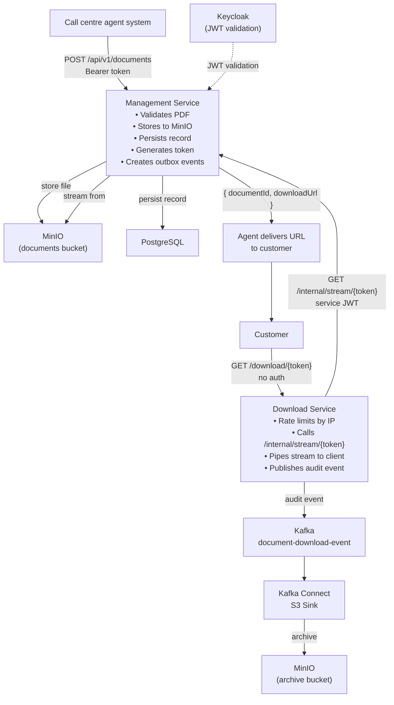
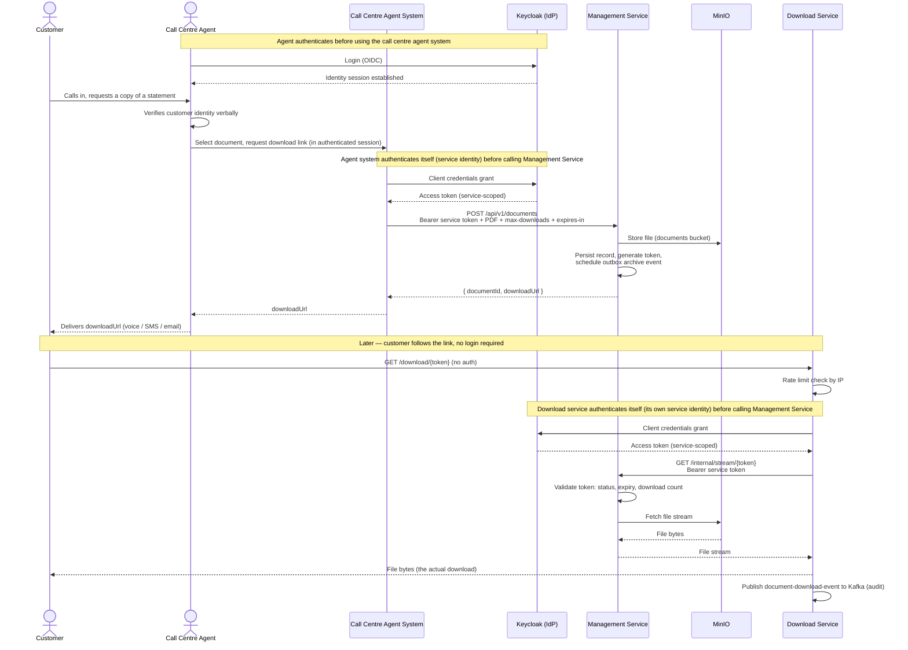
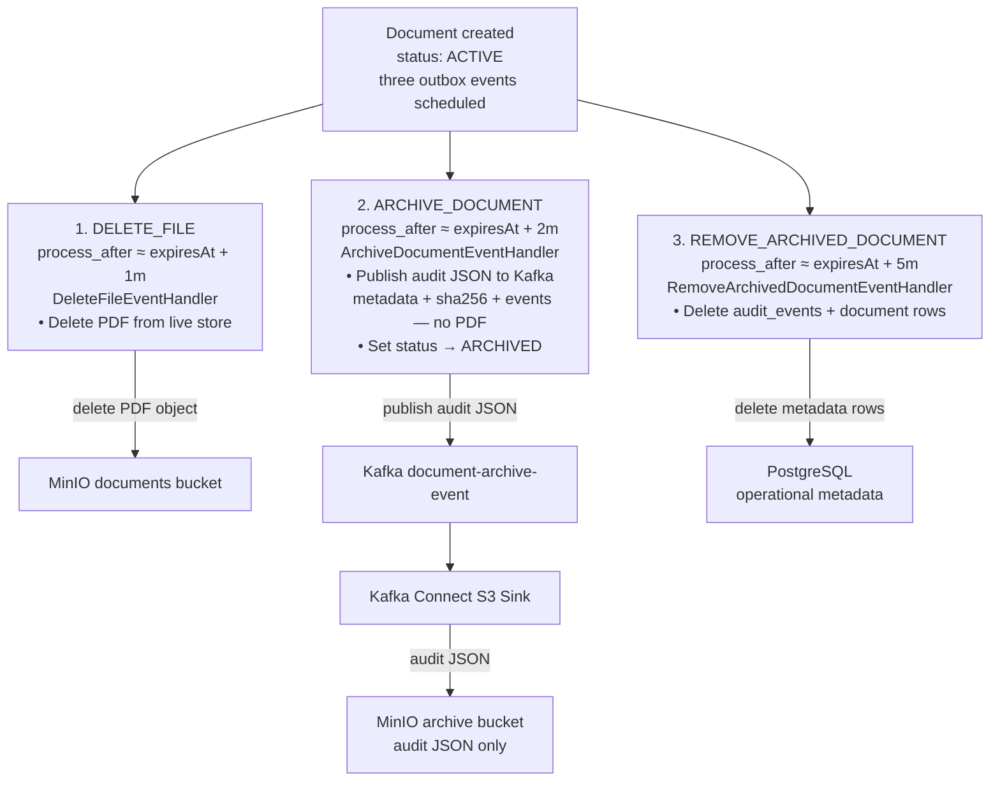
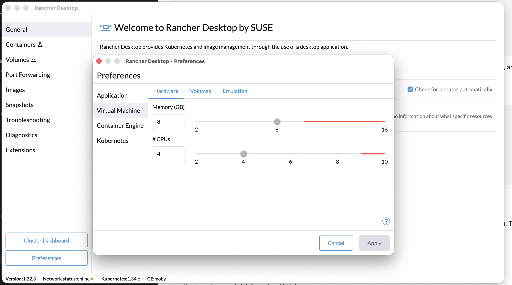

# Secure Download System (SDS)

A system for storing PDF documents and issuing secure, time-limited, download-count-limited access links.

## Overview

This submission is based on the project description:

---
**Secure File Statement Delivery**

Develop a system to store customer account statements as PDF files and provide secure, time-limited download links to customers.

---

After asking for additional clarification, the feedback was that the instruction is intentionally vague, leaving it to the engineer to decide what should be done.

### Interpretation

Based on the above, my interpretation is as follows: If the download link requires an unauthenticated user to log in first, then it would not be a *download link* but a standard *deep link*, which is not what the assignment is asking for. The assumed use-case is therefore for situations where the customer might not have a compatible banking device or login credentials — for example, a call centre interaction. The customer's identity is verified verbally. The call centre agent selects a document (bank statement, account details letter, etc.) and submits it to this system. The system responds with a download link, which is delivered to the customer via the relevant channel (email, WhatsApp, verbally, etc.). The document would ideally be pre-encrypted by the originating system, with the password communicated to the customer over the phone.

### Resulting Impact

The service delivers documents without storing any personal information (PII). A malicious employee who gains unauthorised access to the system, or an external attacker who successfully breaches it, gains extremely limited information. The security footprint or "blast radius" is substantially reduced.

SDS is a **secure delivery plane**, not the long-term store for statement content. PDF bytes live only in the live object store for the delivery window; after lifecycle cleanup only **audit metadata and a content hash** remain (see [ADR-005](docs/adr-005-audit-archive-not-document-store.md)). The upstream system that generated or selected the document remains the system of record; the SHA-256 SDS records is the join key for correlating delivery evidence back to that system.

### Security Measures

- **Time limited.** The source system (e.g. the call centre agent system) defines the download link validity period. Links are generally valid for a short window only.

- **Maximum downloads.** The source system specifies a maximum number of allowed downloads, typically 1 or 2.

- **Cryptographically secure link generation.** Links use a cryptographically secure algorithm that guards against the primary attack vector: enumeration/brute-force attacks. The link length is kept short enough to be shared verbally, which is important for the assumed use-case.

- **Rate limiting.** Secondary protection against enumeration attacks via IP-based rate limiting on the download endpoint.

- **Audit records.** Full audit trail supporting investigations, information requests, and potential evidence in the event of a security breach.

- **Least privilege access.** Each service is granted only the minimum permissions required to perform its function.

- **Service separation.** The system comprises two services. The **management service** handles document ingestion, link creation, and record archiving. It has read/write access to the database and document store. The **download service** has a publicly exposed endpoint and holds no database or document store permissions whatsoever, it accesses documents through a single secured endpoint on the management service. In a production deployment, the management service endpoints would be restricted to known hosts, and the download service would only be permitted to communicate with the management service.

### Design Decision: Custom Implementation vs S3 Pre-signed URLs

Rather than using S3 pre-signed URLs, this system implements a custom token-based download mechanism. This decision is motivated by functional and security requirements that pre-signed URLs cannot satisfy:

1. **Download-count enforcement.** Pre-signed URLs are time-boxed only; S3 has no native "N downloads" cap. The custom implementation tracks each download attempt and blocks further access once the limit is exhausted, enabling precise control over document distribution.

2. **Revocation capability.** Pre-signed URLs remain valid until expiry and cannot be invalidated early. The custom implementation checks document status on every request, enabling immediate revocation if a document is recalled or access is withdrawn.

3. **Audit trail granularity.** Pre-signed URLs generate coarse-grained S3 access logs. The custom implementation publishes Kafka events for each download lifecycle phase (attempt, complete, partial), providing the precise, per-download audit records required for banking compliance and breach investigations.

4. **Information leakage prevention.** Pre-signed URLs expose the S3 bucket name, key structure, and AWS signature format, leaking implementation details. The custom token-based approach uses opaque, cryptographically secure tokens and returns uniform 404 responses for all rejection cases, minimizing information disclosure.

5. **Cloud provider independence.** The token abstraction decouples the business logic from AWS S3. Documents can be migrated to alternative stores (GCS, Azure Blob, on-premise) without changing the client-facing API or audit pipeline.

**Trade-off:** The proxy adds operational burden (two services to scale and monitor) but delivers precise download-count control and revocation capability. In a pure Simplicity-first environment, pre-signed URLs + CloudFront/WAF would be preferred; this custom proxy is justified here by the explicit download-count and revocation requirements.

**See also:** [ADR-001: Custom Proxy vs Pre-signed URLs](docs/adr-001-presigned-urls-vs-proxy.md) for detailed analysis of alternatives considered. [ADR-002: Token Entropy Trade-off](docs/adr-002-token-entropy.md) explains the token length decision and its configurability. [ADR-003: Verification CI Without Deployment](docs/adr-003-no-build-pipeline.md) explains the GitHub Actions verify pipeline (unit tests + image build, no registry push or deploy) and why Compose remains release/run. [ADR-004: Per-Pod Rate Limiting](docs/adr-004-per-pod-rate-limiting.md) explains why rate limiting stays per-instance instead of distributed. [ADR-005: Audit Archive, Not Document Store](docs/adr-005-audit-archive-not-document-store.md) explains why PDF bytes are not retained after the delivery window and how the content hash correlates to the upstream system of record.

## Architecture

### System Overview



### End-to-End Use Case: Link Creation to Download

This sequence shows the full lifecycle for the primary use case, from the customer's initial contact through to the actual file download: the call centre agent's own login, the agent system's machine-to-machine token retrieval, document creation, link delivery, and finally the customer's download (which involves a second, independent machine-to-machine token retrieval by the download service).



Two independent authentications happen before any document ever moves: the **agent's own login** (human identity, gates use of the call centre agent system) and the **agent system's machine-to-machine token** (service identity, gates calls into the Management Service). The download service repeats the machine-to-machine pattern on its own side of the flow — the customer never authenticates at all, by design (see [Interpretation](#interpretation)).

### Outbox Pattern — Document Lifecycle Events

At upload, three outbox events are scheduled with staggered `process_after` times (demo defaults: roughly `expiresAt+1m`, `+2m`, `+5m`). The outbox poller claims due work with `SELECT … FOR UPDATE SKIP LOCKED` and dispatches to handlers. “Delete” means two different things in this flow — **PDF object** vs **DB metadata** — do not conflate them.

**Important:** “Archive” is a durable **audit / lifecycle record** only (metadata, SHA-256 of the bytes accepted, download/revoke events). **PDF bytes are never written to the archive bucket.** The upstream system remains the system of record for statement content. See [ADR-005](docs/adr-005-audit-archive-not-document-store.md).

**Upload create protocol (no orphan objects, streaming body):** after a 4-byte PDF magic check, metadata is committed as **`CREATING`** (placeholder size/hash; not downloadable) with the three outbox events; the request body is then **streamed** once through size limit + SHA-256 into object storage; only on success is the row updated with final size/hash, promoted to **`ACTIVE`**, and an `UPLOAD` audit written. SHA is for ACTIVE correlation/archive — it is **not** a reason to buffer the whole file. If the put (or promote) fails, the row stays `CREATING`: outbox **deletes** any object (idempotent), **skips** audit archive, and **removes** the DB row.

**Intended order after the delivery window ends** (plus outbox poll delay):

1. **`DELETE_FILE`** — remove the **PDF** from the live documents bucket as soon as practical after expiry (content must not linger).
2. **`ARCHIVE_DOCUMENT`** — publish **audit JSON** (no PDF) to Kafka → archive bucket; set status `ARCHIVED`. Needs DB rows still present; does **not** need the PDF.
3. **`REMOVE_ARCHIVED_DOCUMENT`** — delete **metadata** from PostgreSQL (`audit_events` + `document`) only after the audit archive is durable.



| Phase | Deletes / writes | Must finish before |
|---|---|---|
| 1. PDF delete | Live object only | — (independent of archive content) |
| 2. Audit archive | JSON to Kafka/MinIO; status | Phase 3 (DB rows still needed for payload) |
| 3. Metadata remove | DB `document` + `audit_events` | — |

Each handler can fail and retry independently. PDF delete is intentionally **first** so expired content leaves SDS quickly; archive does not depend on those bytes.

## Technology Stack

| Component | Technology |
|---|---|
| Services | Java 25, Spring Boot 4, Maven |
| Database | PostgreSQL 17 |
| Object store | MinIO (S3-compatible) |
| Auth server | Keycloak (OAuth2/OIDC) |
| Message broker | Kafka 3.9 (KRaft mode) |
| Monitoring | Prometheus; Grafana |

## Prerequisites

**All platforms:**
- Docker with Compose support
- My testing has shown that the container virtual machine likely requires more than the typical default of 2GB memory in order to start up the full solution - **4GB memory with 4 CPUs is highly recommended**



**macOS / Linux:**
- Bash-compatible shell
- `curl` for HTTP requests

**Windows:**
- PowerShell 7+ (or Windows PowerShell 5.1)
- `curl` (included in Windows 10/11) or Git Bash

## Quick Start

### macOS / Linux

```bash
# 1. Clone the repository
git clone https://github.com/henkoberholzer/capitec_se3_submission.git
cd capitec_se3_submission

# 2. Start the full stack (creates .env from .env.example if needed)
./start-fresh.sh

# 3. Run end-to-end tests
./run-e2e-tests.sh
```

### Windows (PowerShell)

```powershell
# 1. Clone the repository
git clone https://github.com/henkoberholzer/capitec_se3_submission.git
cd capitec_se3_submission

# 2. Start the full stack (creates .env from .env.example if needed)
.\start-fresh.ps1

# 3. Run end-to-end tests
.\run-e2e-tests.ps1
```

**Configuration:** Demo defaults live in committed [`.env.example`](.env.example). Your local `.env` is **gitignored** and is created automatically on first `start-fresh` — no manual copy step for evaluators. Override ports or passwords in `.env` only if something clashes on your machine.

**Note on Windows execution policy:** If PowerShell complains about script execution, run:
```powershell
Set-ExecutionPolicy -ExecutionPolicy RemoteSigned -Scope CurrentUser
```

---

`start-fresh.ps1` (Windows) / `start-fresh.sh` (Unix) tears down any existing instance, builds all service images, waits for each service to become healthy, and starts everything with a clean slate.

Other scripts included:

| Task | Bash | PowerShell |
|---|---|---|
| Build Management Service | `./build-management-service.sh` | `.\build-management-service.ps1` |
| Build Download Service | `./build-download-service.sh` | `.\build-download-service.ps1` |
| Run unit tests (both services) | `./run-unit-tests.sh` | `.\run-unit-tests.ps1` |
| Tear down stack | `./teardown.sh` | `.\teardown.ps1` |

### Continuous verification (no deploy)

On every push to `main` and on pull requests, GitHub Actions runs [`.github/workflows/verify.yml`](.github/workflows/verify.yml):

1. **Checkstyle + unit tests** for `management-service` and `download-service`
2. **Docker image builds** for both services with **no registry push**

That proves the project **builds and tests** for the commit without inventing a deployment target. Local **release/run** remains Docker Compose (`./start-fresh.sh`). Full-stack e2e stays on-demand via `./run-e2e-tests.sh` after the stack is up. See [ADR-003](docs/adr-003-no-build-pipeline.md).

## Demo UI

After startup, a test UI is available at the port configured by `TEST_CLIENT_PORT` in `.env` (default:  [http://localhost:8031](http://localhost:8031)). The URL is also echoed at the end of `start-fresh.sh`.

The UI allows you to:
- Retrieve an access token from Keycloak using client credentials
- Upload a document (any file type — the server will reject non-PDFs)
- Retrieve document details and audit history
- Revoke a document

## Direct API Access

*Hint*: Import the environment variable into your shell session using the command:
```source .env```

Obtain a token:

```bash
curl -v http://localhost:${KEYCLOAK_PORT}/realms/secure-download-system/protocol/openid-connect/token \
  -d "grant_type=client_credentials" \
  -d "client_id=sds-sample-client" \
  -d "client_secret=${SDS_SAMPLE_CLIENT_SECRET}"
```

Upload a document:

```bash
curl -v http://localhost:${MANAGEMENT_SERVICE_PORT}/api/v1/documents \
  -H "Authorization: Bearer <token>" \
  -H "Content-Type: application/pdf" \
  -H "x-capitec-max-downloads: 2" \
  -H "x-capitec-expires-in: 60" \
  --data-binary @sample-documents/sample_150kb.pdf
```

The upload action will return the download URL, and the document should be available at that URL for the specified number of downloads and time period.

## Monitoring

There is a Spring Boot 2.1 System Monitor dashboard available on Grafana, which is configured to receive data from Prometheus.

Monitoring could be improved for production by checking for failed outbox events.

## Running at Scale

The system is designed for initial scale (100k–1M documents/month, single-region). At higher scales, architectural changes become necessary:

**Bulk Document Generation (10M+/month)**
- Current: Single-threaded REST API uploads
- Scale: Consume from Kafka event stream; batch ingest from S3

**Download Path (10k–50k concurrent)**
- Current: Spring Boot services stream all bytes
- Scale: Offload to CDN (CloudFront + S3 presigned URLs); keep download-service as metadata gate only

**Audit & Archival**
- Current: Kafka → MinIO (daily)
- Scale: Kafka log compaction, lifecycle to S3 Glacier, partitioned by date

**Database**
- Current: Single PostgreSQL instance
- Scale: Read replicas, hash-based partitioning on document_id, Redis cache for hot documents

**Rate Limiting**
- Current: In-memory per-instance
- Scale: Redis-backed (shared state across all download-service instances)

See [DESIGN_NOTES.md](docs/DESIGN_NOTES.md) for detailed analysis of what changes at scale.

## Known Limitations

**Security**
- Token entropy: 40 bits (adequate with rate limiting + expiry, below NIST 128-bit guideline)
- Rate limiting: Per-IP only (not per-document); distributed attack could target specific document

**Performance**
- Outbox processor: Single-threaded across all instances (not coordinated horizontally)
- Rate limiter: In-memory, not shared across instances (cluster-aware version in [DESIGN_NOTES](docs/DESIGN_NOTES.md))

**DevOps**
- Keycloak: Runs in `start-dev` mode (development only; production requires dedicated IdP)
- Secrets: Local demo values in `.env` (gitignored; bootstrapped from `.env.example`); no secrets manager — use Vault/etc. in production
- Backups: No automated disaster recovery or multi-region replication

**Data**
- Audit logs: Immutable once archived (metadata + content hash only — not PDF bytes); no compliance-driven purge schedule defined
- Content retention: PDF is deleted after the delivery window; upstream is system of record for statement content ([ADR-005](docs/adr-005-audit-archive-not-document-store.md))
- Encryption: In transit (HTTPS) only; at-rest encryption not implemented

See [DESIGN_NOTES.md](docs/DESIGN_NOTES.md) for future work priorities.

## Notes

- Local `.env` is gitignored. Committed [`.env.example`](.env.example) holds demo defaults; `start-fresh` copies it to `.env` when missing so evaluators need no manual setup.
- Keycloak memory usage is capped at 1 GB. On memory-constrained machines it may need to be reduced further via `mem_limit` in `docker-compose.yml`.
- For production use, Keycloak must be replaced with (or configured to connect to) the appropriate corporate authorization server, and must not run in `start-dev` mode.
- The test client UI should be removed or disabled in any non-development environment.
- The times for configuration values in this implementation is shortened in order to demonstrate functionality - for example, a document is archived a very short amount of time after expiring vs what the configuration for that would be in production.
